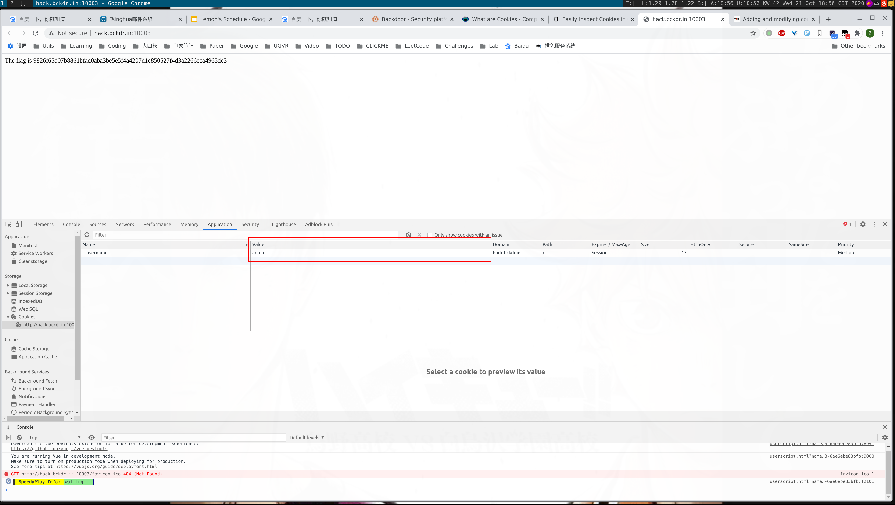

<center><font face="Times New Roman" size="8">Backdoor</font></center>

# Beginners

### 2013-bin-50

- How to Determine the File Type of a File Using Linux: 
  - The file type is part of the file name (not file extension).
  - Using `file`:
    - File system tests: examine the return from a stat system call
    - Magic tests: check the contents of a file and specifically a few bytes at the beginning that help to determine the file type
    - Language tests: checked to see if it is a text file. By testing the first few bytes of a file.

- How to Show a File's Printable Characters With the Strings Command

  - `strings` can transfer binary file to human-readable text.

  - ```shell
    Usage: strings [option(s)] [file(s)]
     Display printable strings in [file(s)] (stdin by default)
     The options are:
      -a - --all                Scan the entire file, not just the data section [default]
      -d --data                 Only scan the data sections in the file
      -f --print-file-name      Print the name of the file before each string
      -n --bytes=[number]       Locate & print any NUL-terminated sequence of at
      -<number>                   least [number] characters (default 4). 
      							只显示长度超过[number]的字段
      -t --radix={o,d,x}        Print the location of the string in base 8, 10 or 16
      							以8/10/16进制的方式显示偏移.
      -w --include-all-whitespace Include all whitespace as valid string characters
      -e --encoding={s,S,b,l,B,L} Select character size and endianness:
                                s = 7-bit, S = 8-bit, {b,l} = 16-bit, {B,L} = 32-bit
      -s --output-separator=<string> String used to separate strings in output.
      								 e.g. string -s "|" ./binary
    ```

  - 注意`echo`本身会自动加一个`\n`在末尾, 如果不要则使用`echo -n` (末尾的换行符会影响`sha256`的结果.)

### 2013-WEB-50

- What Are Cookies?
  - **What's in a Cookie?**: a small lookup table containing **pairs** of (key, data) values, once the cookie has been **read by the code on the server** or client computer, the data can be retrieved and used to customize the web page appropriately.
  - **When are Cookies Created?**: Writing data to a cookie is usually done when **a new web page is loaded** - for example after a '**submit**' button is pressed, the **data handling page** would be responsible for storing the values in a cookie. If the user has elected to disable cookies then the write operation will fail, and subsequent sites which rely on the cookie will either have to *take a default action*, or prompt the user to *re-enter the information* that would have been stored in the cookie.
  - **Why are Cookies Used?**: 
    - Cookies are a convenient way to carry information from **one session on a website to another**, or **between sessions** on related websites.
    - If store data on the server, it would be difficult to retrieve a particular user's information without **requiring a login on each visit to the website**.
- View cookies in chrome:
  - 
  - NOTE that some fields you can modify (e.g. the *value* part, where *username* is the key/name. But the priority field you cannot modify, for that it's generated automatically.)

### Simple Cipher

> In [cryptography](https://en.wikipedia.org/wiki/Cryptography), a **cipher** (or **cypher**) is an [algorithm](https://en.wikipedia.org/wiki/Algorithm) for performing [encryption](https://en.wikipedia.org/wiki/Encryption) or [decryption](https://en.wikipedia.org/wiki/Decryption)—a series of well-defined steps that can be followed as a procedure.

- http://rumkin.com/tools/cipher/