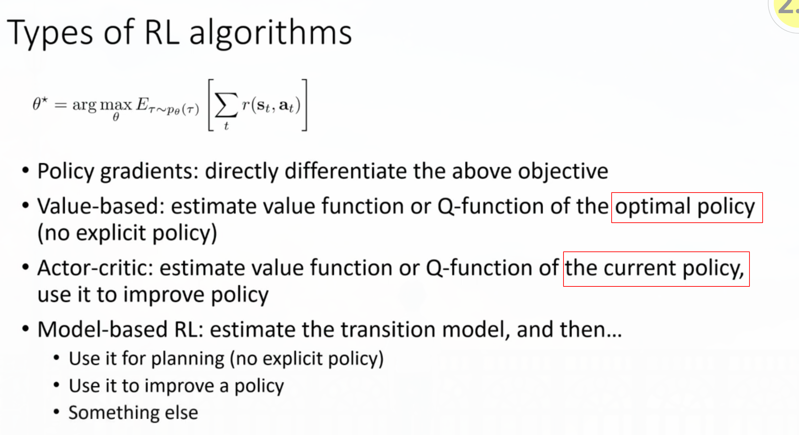
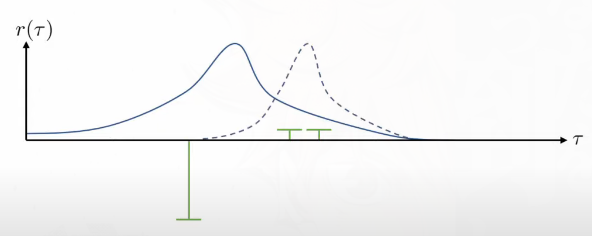
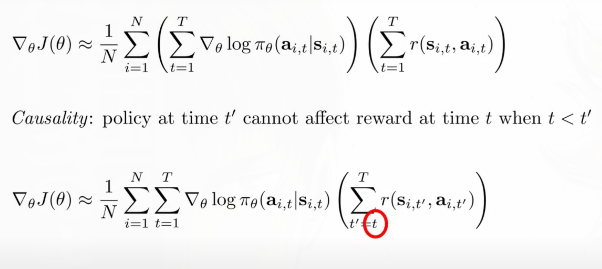
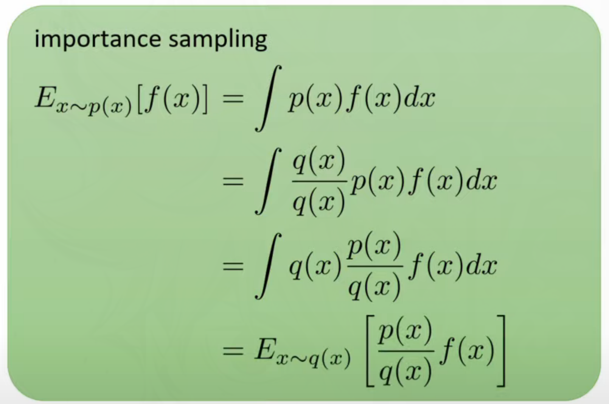
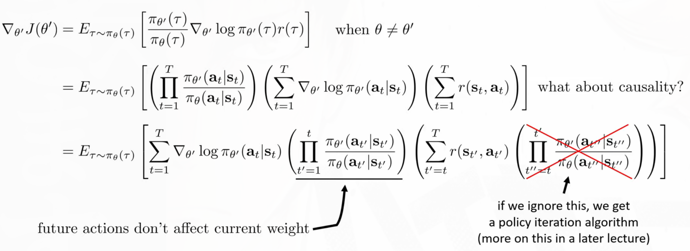
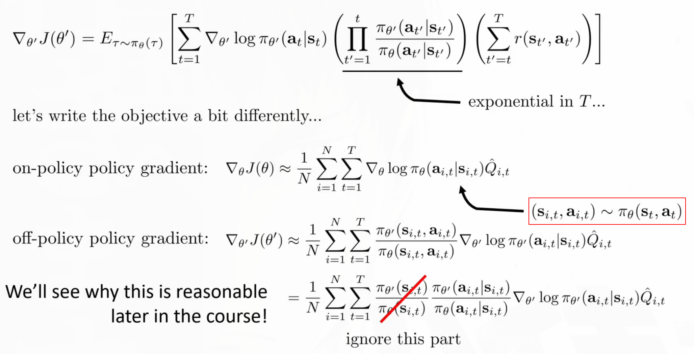
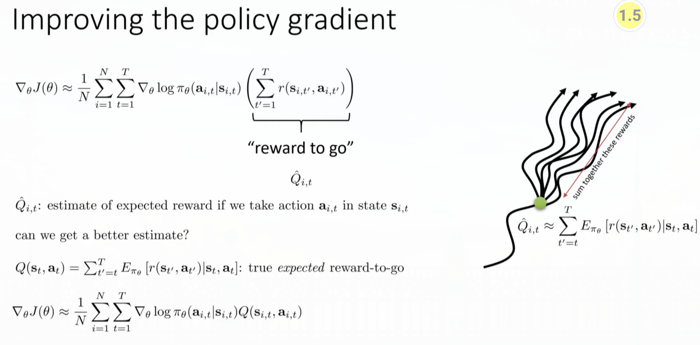
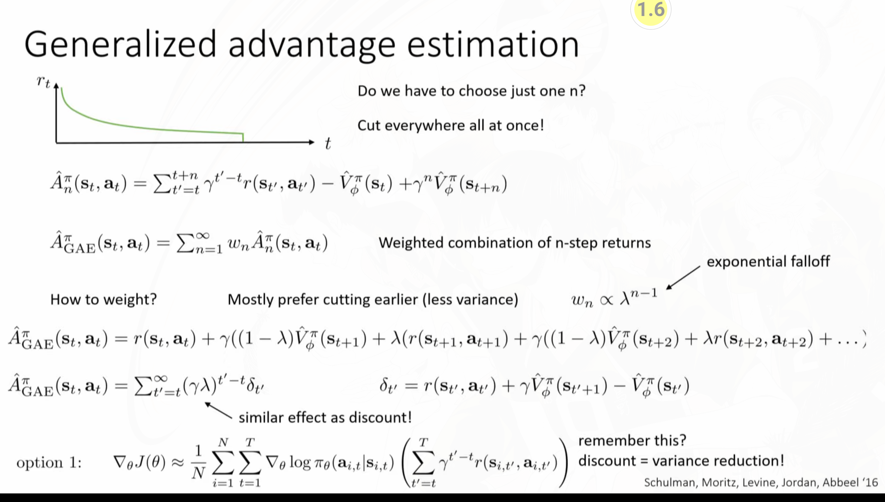

# Lecture 01

# Lecture 04

## 4.1. Definition of MDP 

- Markov chain: $\mathcal{M}=<\mathcal S, \mathcal T>$. (state space and transition operator).
  - Let $\mu_{t,i}=p(s_t=i)$, $\overrightarrow \mu_{t+1}=\mathcal T \overrightarrow \mu_t$
- Markov decision process: $\mathcal{M}=<\mathcal S, \mathcal A, \mathcal T, r>$.
- Partially observed MDP: $\mathcal{M}=<\mathcal S, \mathcal A, \mathcal O, \mathcal T, \varepsilon, r>$, where $\varepsilon$ stands for emission probability $p(o_t|s_t)$.

## 4.2. Definition of RL problem

- $\underbrace{p_\theta(s_1,a_1,\cdots,s_T,a_T)}_{p_\theta(\tau)}=p(s_1)\mathop\Pi\limits_{t=1}^T\underbrace{\pi_\theta(a_t|s_t)p(s_{t+1}|s_t,a_t)}_{\text{Markov chain on (s,a)}}$.

  - Once $\pi_\theta$ is fixed, you can actually view the MDP as a *Markov chain* on an augmented state space (original $\mathcal S$ and $\mathcal A$), $p((s_{t+1},a_{t+1})|(s_t,a_t))=p(s_{t+1}|s_t,a_t)\pi_\theta(a_{t+1}|s_{t+1})$.

- $\theta^*=\arg\max\limits_{\theta}E_{\tau\sim p_{\theta}(\tau)}\left[\sum\limits_{t=1}r(s_t,a_t)\right] $. (Goal)

  - $= \arg\max\limits_{\theta}\sum\limits_{t=1}^TE_{(s_t,a_t)\sim p_\theta(s_t,a_t)}[r(s_t,a_t)]$. (Markov Chain)
  - And thus $\begin{pmatrix}s_{t+k}\\a_{t+k}\end{pmatrix}=\mathcal T^k\begin{pmatrix}s_{t}\\a_{t}\end{pmatrix}$, if $T=\infty$, will $p(s_t,a_t)$ converge to a *stationary* distribution? (just solve $\mu=\mathcal T \mu$)?
    - Yes, under ergodicity.
    - And the expected return under infinite horizon is **dominated** by the stationary state, and thus the objective is $\arg\max\limits_{\theta}E_{(s,a)\sim p_\theta(s,a)}[r(s,a)]$.

- > Even if you take expectations of non-smooth, non-differentiable nasty horrible functions, they can actually be reasonably behaved in the parameters of the distribution under with you take expectation. $\leftarrow$ why GD can work in RL.

## 4.3. Anatomy of a RL algorithm

- 
- Value-based algorithms don't have a essential policy ($\arg\max$ if any).
- How do we deal with *expectations*?
  -  
  - But actually it's not that easy to modify $\pi_\theta$, because $Q$ is also dependent on $\pi_\theta$, but this is the intuition of $Q$.
- The value function and the Q-function:
  - 
  - Idea 1: if we know $Q_{\pi_\theta}$, we can improve $\pi$ greedily.
  - Idea 2: if $Q_{\pi_\theta}(s,a)>V_{\pi_\theta}(s)$, then $a$ is **better than average**. 

## 4.4. Brief overview of RL algorithm types

- 
  - AC is the combination of PG and value-based (it use value function in PG to improve policy).
- **Consideration** for algorithm selection:
  - Sample efficiency.
  - Stability (convergence) and ease use.
  - Assumptions (observability, episodic learning, continuity or smoothness)
- 

# Lecture 05

- Evaluate the objective: 

## 5.1. Policy Gradient

- 
  - 
  - **Why** is the reward independent of $\theta$?
    - If the policy change, the expectation of reward will change, which is accounted for at the front term, but once you sampled $s_t,a_t$ from your policy, the reward will only depend on $s_t,a_t$.

- Basic components of RL algorithm (PG):
  - generate samples: just run the policy.
  - fit a model to estimate return: just run the policy.
  - improve the policy: $\theta=\theta+\alpha\nabla_\theta J(\theta)$
- PG via MLE:
  - $\nabla_\theta log\,\pi_\theta(\tau)$ actually points at the direction that increase $\pi_\theta(\tau)$ (the probability of $\tau$).
  - 
    - PG only increase the probability of good trajectories, while MLE increase the probability of all trajectories.
    - BTW, we might use the built-in MLE-gradient to compute the gradient of PG.
- Why PG won't work?: *the gradient* has high variance!
  - Assume we are trying to tuning a Gaussian policy, and receive three samples, one negative one the left and two positive one the right.
  - 
  - **After adding a big constant to all samples**
  - 
  - **What if the two "good" rewards are zero**?
    - You policy (center of the Gaussian) will shift either left or right depending on the previous position of your policy. (either coming from the left or the right).

## 5.2. Basic variance reduction: causality

- The action you choose now will **not** affect the rewards you received in the past.

  - 

  - This is a still unbiased estimation of PG, but with lower variance. (see paper for proof)

## 5.3. Basic variance reduction: baselines

- We only want the trajectories which are "better" than average to be more often.
  - 
  - Still unbiased! (But the expected return is not actually the optimal choice of baseline.)
-  Analyzing variance for optimal *b*:
  - 
  - 最优的baseline是不同$r(\tau)$基于$g(\tau)^2$ (gradient magnitude)的加权平均. (不要考虑$\nabla_\theta\,log\pi_\theta(\tau)$是向量的情况, 因为那样的话我们就不能仅仅优化Var了,因为Var是矩阵了,优化一个矩阵是一个不明确的操作.)

## 5.4. On-policy via Off-policy

- Importance Sampling (IS):
  - 
  - **需要满足条件**: $p(x)f(x)$ is always 0 whenever $q(x)=0$.
- Problem: the important coefficient will increase the variance:
  - Consider *causality*:
    - 
    - This should **NOT** be a *arbitrary* modification, it's equal to its previous formulation.
  - A little modification to get the **policy iteration** algorithm.
    - Note that you will get a different gradient after this modification, but the new gradient will still improve your policy, but for a different reason.
  - 
  
- A first-order approximation of IS. (**NOTE**: using **state-action** distribution instead of **trajectory** can change $\Pi$ to $\sum$)
  - 

# Lecture 06 Actor-critic  Algorithms

- The key idea for this lecture is to find *better* "reward to go".

## 6.1. Improving the policy gradient with a critic

- Due to the static of RL, a better **"reward to go"** can be an average over possible actions: (and this also bring less variance than single trajectory)
  - 

- Add a **baseline** (Average of what?$\frac{1}{N}\sum\limits_{i}Q(s_{i,t},a_{i,t}); V(s_t)=E_{a_t\sim\pi_\theta(a_t|s_t)}[Q(s_t,a_t)]$)
  - $A(s_{i,t},a_{i,t}) = Q(s_{i,t},a_{i,t})-V(s_{i,t})$: how better this action is than the average action.
- 

  -  

## 6.2. The policy evaluation problem

- Monte Carlo policy evaluation:
  - $V^{\pi}(s_t)\approx\sum\limits_{t'=t}^Tr(s_{t'},a_{t'})$. (It's a little hard to calculate $\sum\limits_i\sum\limits_{t'=t}^Tr(s_{i,t'},a_{i,t'})$ because this requires to reset the simulator to the exact state $s_{t'}$)
  - Different targets in supervised learning: 
    - 
    - The ideal target is a slightly incorrect (at initial state it's better to use MC target) but has a lower variance (especially useful when  the environment is very stochastic). 
- 

## 6.3. Discount factors

- When $T\rightarrow\infty$, $\bar{V}^{\pi}_{\phi}$ can get infinitely large in many cases. Simple trick. use $\gamma\in[0,1], e.g.\,0.99$, better to get rewards sooner than later.
  - $\gamma$ **changes** the MDP, the agent now has the probability $1-\gamma$ to die at every state.
    - 
- PG with discount factors:
  - 
  - The critic is actually equals to option 1, and if we change the form of option 2:
    - 
    - The latter gradients are also smaller due to the discount factors.
  - Option 1 is we frequently use, while option 2 is actually dealing  with the MDP where you have probability $1-\gamma$ to die at every state.
    - In option 1, $\gamma$ can be viewed as a way to eliminate variance in your value estimator.

## 6.4. The actor-critic algorithm

- Architecture design:
  - 
    - In shared network design, you have to carefully balance two different gradient (and their magnitudes) so that one won't be blown off by the other.
- 
  - Tricks : Gu et al. 2016 (Q-prop)
- Eligibility traces & n-step returns:
  - 
  - We want to use MC in the short term and C in the long term, one way is to **cut off the tails** in MC so we won't be affected by the high variance caused by the infinite future.
    - 
    - We can add $\gamma^n\bar{V}_\phi^\pi(s_{t+n})$ to compensate for the cut tail.
      - 

- GAE:
  - 